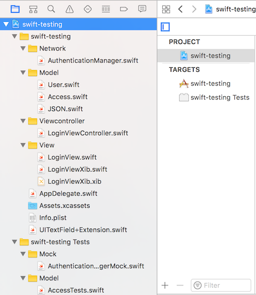
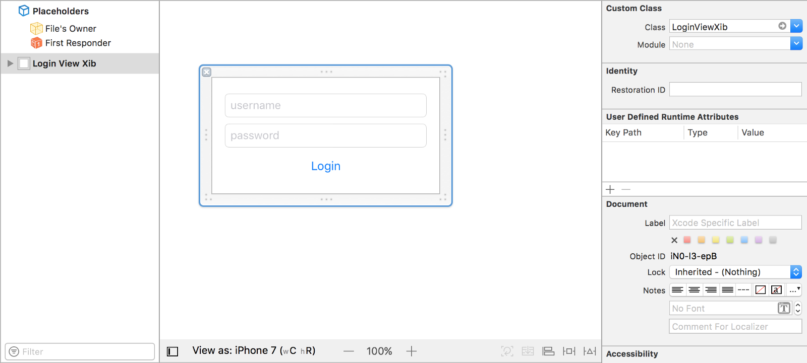
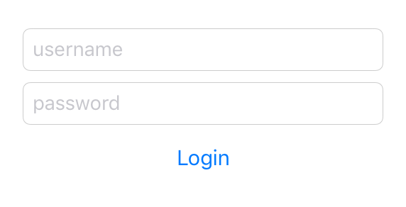
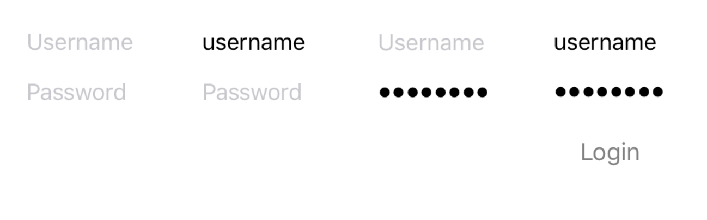
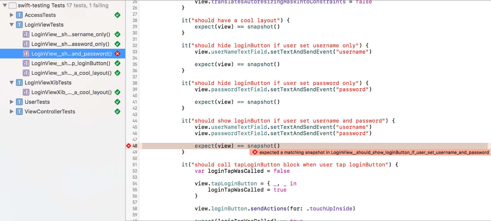
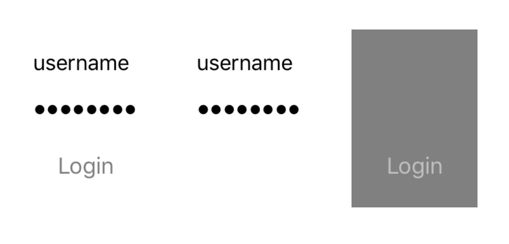
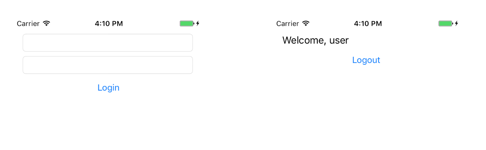
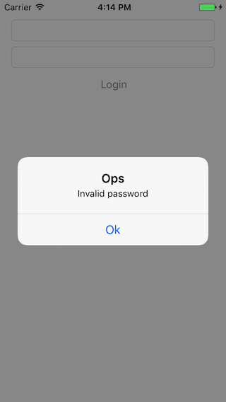

# Guia de testes iOS
-

## Objetivo
O objetivo deste documento é organizar uma séries de posts e um único local para tornar fácil o entendimento de testes.

## Pra que servem testes?

Por um longo período, eu programei sem escrever uma única linha de teste. Na verdade, eu pensava que escrever testes era uma perda de tempo até começar a trabalhar em uma empresa na qual eu deveria criar novos recursos para um aplicativo mal escrito. Toda vez que eu escrevia uma nova linha, eu revisava o app centenas de vezes apenas para ter certeza que tudo estava funcionando e mesmo assim ainda ficava com um pé atrás na hora de gerar uma nova release. Isso me fez perceber a importância dos testes, mas mesmo com isso em mente eu não dava o valor necessário.

## O 5W2H dos testes

5W2H é uma ferramenta de gestão que significa: what (o que), why (por que), where (aonde), when (quando), who (quem), how (como) e how much (quanto custa). É usado como um checklist para tarefas a serem desenvolvidas mas são pergutas importantes que todo desenvolvedor deve saber responder quando se trata de testes.

### O que? (O que são testes?)

São trechos de código que visam testar métodos, funções, classes etc. Testar significa verificar o comportamento e assegurar que o mesmo está como o esperado. Por isso é importante testar casos de sucesso e casos de erro.

### Por que? (Porque devemos escrever testes?)

Testar deixa o código mais seguro para novas implementações. Durante o desenvolvimento de uma nova feature o desenvolvedor não irá precisar se preocupar se o novo código fez com que uma funcionalidade antiga deixasse de funcionar.

### Aonde? (Em que projetos devemos escrever testes?)

Devem ser feitos em todos os projetos, até nos que são feitos por um único desenvolvedor. Pois escrever testes ajuda a escrever um código mais limpo e desacoplado.

### Quando? (Qual momento devemos escrever testes?)

No momento do desenvolvimento daquela funcionalidade. Um teste não deve ser deixado como débito técnico para ser entregue no futuro ou em uma próxima sprint. Ele deve fazer parte do desenvolvimento daquela funcionalidade.

### Quem? (Quem é o responsável por escrever os testes?)

O teste deve ser escrito pelo mesmo profissional que está desenvolvendo a funcionalidade pois ninguém melhor do que ele sabe como feita a implementação.

### Como? (Como devemos escrever testes?)

Existem diversas maneiras de se escrever testes para iOS. Diversos frameworks que serão descritos abaixo mas o importante é que o COMO deve ser alinhado com o time para que um padrão seja mantido.

### Quanto custa? (Quanto custa escrever um testes?)

Escrever testes custa sim! O desenvolvedor irá parar por algumas horas para poder assegurar que seu código esteja com uma cobertura de testes aceitável mas ele não deve ser encarado como um custo que pode ser removido ou ignorado no projeto pois caso o projeto opte por não fazer testes o custo de manutenção do projeto irá aumentar.

## Os 3A's dos testes

Escrever um código de teste é diferente do que escrever um código para um aplicativo. Quando eu digo que é diferente não é em relação à sintaxe mas sim na lógica da escrita pois testes são escritos seguindo os 3A's que são: arrange, act, assert.

### Arrange

Neste momento você deve configura tudo que você precisa pro seu teste, instânciar objetos, mockar serviços, preparar respostas e etc.

### Act

No segundo momento você deve agir, ou seja, fazer aquela chamada que será testada ou passar parâmetros necessários para o objeto.

### Assert

E por último você deve verificar o resultado do teste. Checar se aquele boleano é `true` ou `false` se o nome da pessoa é `Rodrigo` e outras validações.

```swift
func test() {

	//Arrange
	let a = "a"
	let b = "b"
	let expectedResult = false
	let sut = MyObject()
	
	//Act
	result = sut.method(a, b)
	
	//Assert
	Assert.equal(expectedResult, result)
}
```

## O que aprendi com 1 mês de TDD.

Um dia meu colega de trabalho veio com uma ideia: “vamos começar este novo projeto com um novo processo, vamos usar TDD!”. Mas o que diabos é TDD? Pois bem, é um processo de software que incentiva programadores a escrever testes antes de escrever código.

> Test Driven Development (TDD) ou em português Desenvolvimento guiado por testes é uma técnica de desenvolvimento de software que se relaciona com o conceito de verificação e validação e se baseia em um ciclo curto de repetições: Primeiramente o desenvolvedor escreve um caso de teste automatizado que define uma melhoria desejada ou uma nova funcionalidade. Então, é produzido código que possa ser validado pelo teste para posteriormente o código ser refatorado para um código sob padrões aceitáveis. 

<p align="center">
	
</p>

Até aquele momento eu não havia escrito muitos códigos de teste e eu sabia que aquela decisão ia me fazer sofrer (em uma boa maneira). Iria aprender sobre testes, novas libs, e o mais importante: como escrever um bom código de teste.

Por duas semanas fizemos pair programming para que eu pudesse me acostumar com o TDD e seu ciclo de vida, que é: você escreve um código de teste, executa e ele provavelmente vai falhar. Na verdade, ele deve falhar e agora você pode escrever algum código, mas apenas o mínimo para fazer o seu teste passar. Execute o teste novamente, e ele deve passar. Então, você pode escrever mais testes ou refatorar seu código anterior sem adicionar novos recursos.

<p align="center">
	
</p>

### O que eu realmente aprendi com TDD?

Antes de tudo eu aprendi como escrever testes, de um parse de JSON até como testar uma UIView, e isso é maravilhoso porque não preciso mais testar meu app um bilhão de vezes em um simulador (ou device) antes de lançar uma feature nova. Os testes unitários fazem isso por você.

Segundo, eu me acostumei a escrever testes, e isso não é mais um monstro embaixo da cama. Na verdade, agora eu prefiro escrever testes antes do código e isso me fez escrever códigos melhores. Se você tem problemas em escrever testes provavelmente seu código está uma bagunça e você deveria refatorá-lo.

E por último, escrever testes fazem com que o código seja melhor escrito usando patterns e deixando as classes pouco acopladas melhorando a manutenibilidade do mesmo.

## Frameworks

### XCTest

O [XCTest] (https://developer.apple.com/documentation/xctest?changes=_8) é um framework criado pela Apple para escrita de testes unitários, de performance e UI.

> Use the XCTest framework to write unit tests for your Xcode projects that integrate seamlessly with Xcode's testing workflow.


### Quick

O [Quick] (https://github.com/Quick/Quick) é um framework que estrutura e organiza os testes definindo contextos para diferentes tipos de testes, `beforeEach` e o teste por si só. É útil  para deixar seus testes mais legíveis.

> Quick is a behavior-driven development framework for Swift and Objective-C

### Nimble

[Nimble] (https://github.com/Quick/Nimble) é um framework de `matchers` ou seja
de asserções. Em vez de usar : `XCTAssertEqual(1+1,2,"expected one plus one equal two")` você escreve `expect(1+1) == 2`

> Use Nimble to express the expected outcomes of Swift or Objective-C expressions

### iOSSnapshotTestCase

Antigo FBSnapshotTestCase, o [iOSSnapshotTestCase] (https://github.com/uber/ios-snapshot-test-case/) tira fotos da tela do seu aplicativo e faz comparações  pixel a pixel com uma imagem de referência. Caso encontre alguma diferença o teste falha.

> A "snapshot test case" takes a configured UIView or CALayer and uses the renderInContext: method to get an image snapshot of its contents. It compares this snapshot to a "reference image" stored in your source code repository and fails the test if the two images don't match.

### KIF

[KIF] (https://github.com/kif-framework/KIF) é um framework para escrever testes de integração muito utilizado para testar eventos de UI como um `tap` em um botão, um `scroll` em uma UITableView ou até mesmo um fluxo inteiro de cadastro.

> KIF, which stands for Keep It Functional, is an iOS integration test framework. It allows for easy automation of iOS apps by leveraging the accessibility attributes that the OS makes available for those with visual disabilities.

### EarlGrey


[EarlGrey] (https://github.com/google/EarlGrey) é uma ferramenta de automação de testes de UI para iOS. Ela disponibiliza várias features dentre as quais podemos destacar: 

* Sincronização de UI, rede, threads entre outros
* Verificação de visibilidade do componente;
* Simula a interação real do usuário através das APIs de eventos de touchs no nível de aplicação;

> EarlGrey is a native iOS UI automation test framework that enables you to write clear, concise tests.


## Testes na prática

Os exemplos abaixo foram tirados de posts do medium e traduzidos. Alguns podem não executar por diversos mas o importante é entender a essencia do teste e o motivo.

* [Unit Testing — UIView with Nimble+Snapshot] ()
* [Unit Testing — Parsing a JSON response] ()
* [Unit Testing — Network request] ()
* [Unit Testing — UITableView] ()
* [Unit Testing — KIF and FBSnapshot] ()

### Unit Testing — UIView with Nimble+Snapshot

Hi everyone, I’m currently working on a series of post that shows how to write some kind of tests for iOS and this is the first one.

In my last post, I talked about TDD and some testing frameworks that helped me a lot when we talk about testing on iOS platform. Here we are going to see how to unit test an UIView created by an XIB file or via code using Cartography.

If you want to learn more about Cartography and view code you can check it out on this post. Now let’s learn about testing!

#### Set up your project
First, we need to install Quick, Nimble and Nimble+Snapshot on our project. You can do this by adding pod 'Nimble' pod 'Quick' and pod 'Nimble-Snapshots' to your Podfile. Don’t forget to set these frameworks on the test target, if you don’t have one you can create a new in your project. To do that you can select your project -> target -> + -> iOS Unit Testing Bundle and give it a name.

<p align="center">
	
</p>

Your Podfile should look like this:

```ruby
target 'swift-testing' do
  
  use_frameworks!
  
  pod 'Cartography'

  target 'swift-testing Tests' do
    pod 'Nimble'
    pod 'Quick'
    pod 'Nimble-Snapshots'
  end

end
```

#### Using an XIB file
Create your XIB file and its class to look like a login form. Don’t forget to add constraints.

<p align="center">
	
</p>

Our swift file is just a simple UIView custom class:

```swift
import UIKit

class LoginViewXib: UIView {
    
}
```

Now we gonna create a test to make sure our view is cool and our future code doesn’t mess it up.

```swift
import Quick
import Nimble
import Nimble_Snapshots

@testable import swift_testing

class LoginViewXibTests: QuickSpec {
    
    override func spec() {

        describe("LoginViewXib"){

            var view: LoginViewXib!
            
            beforeEach {
                view = Bundle.main.loadNibNamed("LoginViewXib",
                                                owner: nil,
                                                options: nil)?.first as! LoginViewXib
            }
            
            it("should have a cool layout") {
                expect(view) == recordSnapshot()
            }
        }
    }
}
```
We load our view using Bundle.main.loadNibNamed("LoginViewXib", owner: nil, options: nil)?.first as! LoginViewXib .

If you run this test code (Cmd+U) it will fail because recordSnapshot() will always return an error, this method will record a screenshot of your view and fail. After that, you can change it to snapshot() . Finally, you can run you test code again and it should pass.

To make sure your view is cool look at your project’s folder, inside your unit test folder will have a new folder called ReferenceImages and inside this you will see a picture of your view and it should be like:

<p align="center">
	
</p>

#### Using view code
Now let’s create the same test using view code. First, create your new UIView custom class file, add two UITextField and one UIButton and add constraints with Cartography.

```swift 
import UIKit
import Cartography

class LoginView: UIView {
    
    var tapLoginButton: ((_ username: String, _ password: String) -> ())?
    
    let userNameTextField = { () -> UITextField in
        let textField = UITextField()
        textField.placeholder = "Username"
        textField.accessibilityLabel = "Username"
        textField.addTarget(self, action: #selector(textFieldDidChange(_:)), for: .editingChanged)
        textField.autocapitalizationType = .none
        return textField
    }()
    
    let passwordTextField = { () -> UITextField in
        let textField = UITextField()
        textField.placeholder = "Password"
        textField.accessibilityLabel = "Password"
        textField.addTarget(self, action: #selector(textFieldDidChange(_:)), for: .editingChanged)
        textField.autocapitalizationType = .none
        textField.isSecureTextEntry = true
        return textField
    }()
    
    let loginButton = { () -> UIButton in
        let button = UIButton()
        button.accessibilityLabel = "Login"
        button.setTitle("Login", for: .normal)
        button.setTitleColor(.gray, for: .normal)
        button.isHidden = true
        return button
    }()
    
    init() {
        super.init(frame: CGRect.zero)
        build()
    }
    
    required init?(coder aDecoder: NSCoder) {
        fatalError("init(coder:) has not been implemented")
    }
    
    func build() {
        buildViewHierarchy()
        buildConstrains()
        setup()
    }
    
    func buildViewHierarchy() {
        addSubview(userNameTextField)
        addSubview(passwordTextField)
        addSubview(loginButton)
    }
    
    func buildConstrains() {
        
        let verticalMargin: CGFloat = 16.0
        let horizontalMargin: CGFloat = 8.0
        
        constrain(self, userNameTextField, passwordTextField, loginButton) { view, username, password, login in
            
            username.top == view.top + verticalMargin
            username.left == view.left + horizontalMargin
            username.right == view.right - horizontalMargin
            
            password.top == username.bottom + verticalMargin
            password.left == username.left
            password.right == username.right
            
            login.top == password.bottom + verticalMargin
            login.left == password.left
            login.right == password.right
            login.bottom == view.bottom - verticalMargin
        }
    }
    
    func setup() {
        self.loginButton.addTarget(self, action: #selector(tapLogin), for: .touchUpInside)
    }
    
    func tapLogin() {
        
        guard let username = userNameTextField.text, let password = passwordTextField.text else {
            return
        }
        
        self.tapLoginButton?(username, password)
    }
    
    func textFieldDidChange(_ textField: UITextField) {
        if self.userNameTextField.isEmpty() || self.passwordTextField.isEmpty() {
            self.loginButton.isHidden = true
        } else {
            self.loginButton.isHidden = false
        }
    }
}
```

If you take a better look in this file you will find a closure to be called when the user taps our UIButton and the UIButton will start hidden and only will appear to the user when our UITextFields are filled.

We created an isEmpty() method as an Extension of UITextField to check if our UITextFields are filled with something.

```swift
extension UITextField {
    func isEmpty() -> Bool {
        if let text = self.text, text.trimmingCharacters(in: NSCharacterSet.whitespacesAndNewlines).isEmpty {
            return true
        }
        
        return false
    }
}
```
Now let’s write our test code. In this case, we are going to write a few more tests to make sure if our UIButton is appearing when user fill his username and password.

```swift
import Quick
import Nimble
import Nimble_Snapshots

@testable import swift_testing

class LoginViewTests: QuickSpec {
    
    override func spec() {
        
        describe("LoginView") {
     
            var view: LoginView!
            
            beforeEach {
                view = LoginView()
                view.translatesAutoresizingMaskIntoConstraints = false
            }
            
            it("should have a cool layout") {
                expect(view) == recordSnapshot()
            }
            
            it("should hide loginButton if user set username only") {
                view.userNameTextField.setTextAndSendEvent("username")
                
                expect(view) == recordSnapshot()
            }
            
            it("should hide loginButton if user set password only") {
                view.passwordTextField.setTextAndSendEvent("password")
                
                expect(view) == recordSnapshot()
            }
            
            it("should show loginButton if user set username and password") {
                view.userNameTextField.setTextAndSendEvent("username")
                view.passwordTextField.setTextAndSendEvent("password")
                
                expect(view) == recordSnapshot()
            }
        }
    }
}
```

We created an UITextField extension to help us set the text and send an editingChanged action. If you use username.setText("username") it will not act like a real person is typing in your UITextField because it will not trigger the editingChanged event.

```swift
import UIKit

extension UITextField {
    func setTextAndSendEvent(_ text: String) {
        self.text = text
        self.sendActions(for: .editingChanged)
    }
}
```

In this test file we create our view in a different way that’s because we do not have an XIB file. We do this creating a new object using LoginView() and then calling view.translatesAutoresizingMaskIntoConstraints = false if we do not call this method our test will fail because our view will have a zero (0,0) size. Calling this method makes our view to resize itself based on its constraints.

This test will create four snapshots that should look like theses below: One with our fields empty, another one with only username filled other only with password and the last one with both UITextFields filled and with our UIButton appearing on the screen.

<p align="center">
	
</p>


Like our previous test with an XIB, these screenshots will be created in your projects folder. You can check them everytime you want.

#### How Nimble+Snapshot works?
You’re probably asking me — How I’m going to know when I break my view or what did I break? Nimble+Snapshot create a diff screenshot and a fail one when you break your test. Let’s see this in a practical way.

Let’s comment our textFieldDidChange() method to remove the hide/show behavior.

```swift
func textFieldDidChange(_ textField: UITextField) {
//      if self.userNameTextField.isEmpty() || self.passwordTextField.isEmpty() {
//          self.loginButton.isHidden = true
//      } else {
//          self.loginButton.isHidden = false
//      }
}
```

Run you test (Cmd+U) and you will see that a test fail.

<p align="center">
	
</p>

If you take a look at your log (you can filter by png ) Nimble+Snapshot printed a path to images of the failing test. Open Finder -> Go -> Go to Folder (Cmd+Shif+G) and paste the path. The path is something like: /Users/youruser/Library/Developer/CoreSimulator/Devices/adeviceid/data/Containers/Application/anapplicationid/tmp/LoginViewTests/failed_LoginView_should_show_loginButton_if_user_set_username_and_password@2x.png

<p align="center">
	
</p>

The folder contains three images: reference, failed and a diff. Based on theses images you can see what you’ve broken in your code and fix it.

Testing a UIView is a good way to know if you break something while coding or even if your code is behaving as expected. As you can see we didn’t need to write a test to verify our show/hide behavior, we check that by snapshotting our view.

If you want to learn more about Snapshot and UITesting you can check out this talk on realm.io.

### Unit Testing — Parsing a JSON response
Nowadays with a lot of different programming language, we needed to create a way to be able to communicate with all kinds of applications e.g. we can have an iOS app that consumes a node.js application and this same service can also be consumed by an Android or even a voice device like Amazon’s Alexa.

These applications may have different languages, architecture and be created by different companies so how can they exchange data? It can be archive by using XML, YAML, JSON and others. In this post, we are going to see how to parse a JSON to an object class in our project.

#### But WTH is JSON?
JSON is a common format used to exchange data between computers a.k.a mobile devices, desktop, notebooks, servers, smart watches and more.

> JSON (JavaScript Object Notation) is a lightweight data-interchange format. It is easy for humans to read and write. It is easy for machines to parse and generate. (from json.org)

When your cellphone request the nearest fast food to a server it probably will return a response in a JSON format like this.

```
{
    "id": 1,
    "name": "The nearest fast food",
    "address": Main St,
    "tags": ["fast", "food"]
}
```

In our project, we will do a request that will return some user info like username, email, age and a list of access. We expect our server response to be something like:

```
{
    "username": "username",
    "email": "em@il",
    "age": 26,
    "access": ["profile": true, "timeline": true, "friends": true, "dashboard": true]
}
```

This response should be documented in a swagger file or something like that. Remind that the server can return different responses e.g. a 404 status.

We need to parse our JSON, that means to grab the expected response and turn into objects. There is a lot of libraries that helps you to do that like ObjectMapper or Gloss. Here we are going to build or own parse. Why? Because we can declare our variables with let and non-optional (many of theses libraries you need to declare your properties with var and optional and I don’t like it) and to learn a bit more.

A JSON response is a key value type so we can create a type alias to [String: Any] :

typealias JsonObject = [String: Any]

And then we can create our User and Access struct. Our parse will be done at our init method which will receive a JsonObject aka [String: Any] and parse it to our properties.

```swift 
struct User {
    
    let username: String
    let email: String
    let age: Int
    let access: Access
    
    init?(json: JsonObject) {
        guard let username = json["username"] as? String else {
            return nil
        }
        
        guard let email = json["email"] as? String else {
            return nil
        }
        
        guard let age = json["age"] as? Int else {
            return nil
        }
        
        self.username = username
        self.age = age
        self.email = email
        self.access = Access(json: json["access"] as? JsonObject)
    }
}

struct Access {
    
    let profile: Bool
    let timeline: Bool
    let friends: Bool
    let dashboard: Bool
    
    init(json: JsonObject?) {
        self.profile = json?["profile"] as? Bool ?? false
        self.timeline = json?["timeline"] as? Bool ?? false
        self.friends = json?["friends"] as? Bool ?? false
        self.dashboard = json?["dashboard"] as? Bool ?? false
    }
}
```
After that we can create a test to see if our parser is working (or create the test first if you are using TDD)

Let’s start by testing our Access struct. You probably notice that it has a init that always result in an Access object this mean that if our JSON comes with a missing key it will be parsed to false. To help writing our test we create an extension to Access with a static function that returns a valid JSON.

```swift 
import Nimble
import Quick

@testable import swift_testing

extension Access {
    static func validJson() -> JsonObject {
        return [
            "profile": true,
            "timeline": true,
            "friends": true,
            "dashboard": true
        ]
    }
}

class AccessTests: QuickSpec {
    
    override func spec() {
        describe("Access") {
            var access: Access!
            var validJson: JsonObject!
            
            beforeEach {
                validJson =  Access.validJson()
            }
            
            it("should parse all properties") {
                access = Access(json: validJson)
                
                expect(access.profile) == true
                expect(access.timeline) == true
                expect(access.friends) == true
                expect(access.dashboard) == true
            }
            
            it("should parse false for missing profile") {
                validJson.removeValue(forKey: "profile")
                access = Access(json: validJson)
                
                expect(access.profile) == false
                expect(access.timeline) == true
                expect(access.friends) == true
                expect(access.dashboard) == true
            }
            
            it("should parse false for missing timeline") {
                validJson.removeValue(forKey: "timeline")
                access = Access(json: validJson)
                
                expect(access.profile) == true
                expect(access.timeline) == false
                expect(access.friends) == true
                expect(access.dashboard) == true
            }
            
            it("should parse false for missing friends") {
                validJson.removeValue(forKey: "friends")
                access = Access(json: validJson)
                
                expect(access.profile) == true
                expect(access.timeline) == true
                expect(access.friends) == false
                expect(access.dashboard) == true
            }
            
            it("should parse false for missing dashboard") {
                validJson.removeValue(forKey: "dashboard")
                access = Access(json: validJson)
                
                expect(access.profile) == true
                expect(access.timeline) == true
                expect(access.friends) == true
                expect(access.dashboard) == false
            }
        }
    }
}
```

We wrote 5 tests.

* One testing the parse of all properties. We call Access(json: validJson) and expect that all our properties will be parsed which means, in our example, all properties be true.
* Four others will test a missing property. We remove a property from our valid JSON and expect it to be false when our object is created.
If you run all tests, they all should pass

Our User struct is a little bit different because it will not parse invalid properties which mean if our server returns a JSON missing one property our parse will fail and return nil and that is done on purpose.

Let’s build an extension to our User like we did on Access, which will return a valid JSON. And then wrote our tests: one checking if all properties will be parsed and three more removing properties and check if it returned nil.

```swift
import Nimble
import Quick

@testable import swift_testing

extension User {
    static func validJson() -> JsonObject {
        
        return [
            "username": "username",
            "email": "user@mail.com",
            "age": 26,
            "access": [
                "profile": true,
                "timeline": true,
                "friends": true,
                "dashboard": true
            ]
        ]
    }
}

class UserTests: QuickSpec {
    
    override func spec() {
        describe("User") {
            var user: User!
            var validJson: JsonObject!
            
            beforeEach {
                validJson =  User.validJson()
            }
            
            it("should parse all properties") {
                user = User(json: validJson)
                
                expect(user.username) == "username"
                expect(user.email) == "user@mail.com"
                expect(user.age) == 26
                expect(user.access.profile) == true
                expect(user.access.timeline) == true
                expect(user.access.friends) == true
                expect(user.access.dashboard) == true
            }
            
            it("should not parse for missing username") {
                validJson.removeValue(forKey: "username")
                user = User(json: validJson)
                
                expect(user).to(beNil())
            }
            
            it("should not parse for missing email") {
                validJson.removeValue(forKey: "email")
                user = User(json: validJson)
                
                expect(user).to(beNil())
            }
            
            it("should not parse for missing age") {
                validJson.removeValue(forKey: "age")
                user = User(json: validJson)
                
                expect(user).to(beNil())
            }
        }
    }
}
```

With theses examples, you can create your own JSON’s parse. The same test structure can be used with other libraries just remember to test the behavior expected e.g. in Access it should parse even if a property is missing and in User, it should return nil.

### Unit Testing — Network request
Nowadays almost every app do a network request to authenticate a user, request an advertising data or to track how users use it. Network request is the way the app uses to update data and show new information without the need of the user update it at App Store or Google Play.

There are some libraries that help developers perform network requests on the iOS world. On this post, we are going to use Alamofire.

A network request returns an error or a success and this success come with a response that can be a JSON string. So we are going to create an enum called Result to handle that.

Our Result is a generic enum that can receive any object in case of success or returns a simple error. This error can be replaced by error(Error) to return an error object, but for this example, we choose to keep it simple.

```swift
enum Result<T> {
    case success(T)
    case error
}
```

Now let’s create another enum to handle our JSON response which can be an array of objects or a simple one. We are going to use a type alias JsonObject, so don’t forget to declare typealias JsonObject = [String: Any]

```swift
enum Json {
    case object(_: JsonObject)
    case array(_: [JsonObject])
    
    init?(json: Any) {
        if let object = json as? JsonObject {
            self = .object(object)
            return
        }
        
        if let array = json as? [JsonObject] {
            self = .array(array)
            return
        }
        
        return nil
    }
}
```

This enum will try to parse our JsonObject as an object, if it can’t be parsed we try to parse it as an array and if it still can’t be parsed we return nil.

#### Network protocol
Now we should isolate our request library in our code this means to create a wrapper around Alamofire so it can be easily replaced if needed. To achieve this we will create a protocol called NetworkRequest with a func request(_ url: URL, method: HTTPMethod, parameters: [String: Any]?, headers: [String: Any]?, completion: @escaping(Result<Json>) -> void)

```swift
protocol NetworkRequest {
    func request(
        _ url: URL,
        method: HTTPMethod,
        parameters: [String: Any]?,
        headers: [String: String]?,
        completion: @escaping (Result<Json>) -> Void)
        -> Void
}
```

If you take a better look you will see that our completion returns a Result<T> which T is a Json . What this exactly mean? If our request reaches the server our result will be a success and it will return a Json associated. Remember that our Json can contain an object or array.

Now we create our RealNetworkRequest that will implement our NetworkRequest protocol. This is the wrapper that we are going to build around Alamofire.

```swift
class RealNetworkRequest: NetworkRequest {
    
    func request(_ url: URL, method: HTTPMethod, parameters: [String : Any]?, headers: [String : String]?, completion: @escaping (Result<Json>) -> Void) {
        
        Alamofire.request(url,
                          method: method,
                          parameters: parameters,
                          encoding: URLEncoding.default,
                          headers: headers).responseJSON(completionHandler: { (response) in
                                    if let value = response.result.value, let result = Json(json: value) {
                                        completion(.success(result))
                                    } else {
                                        completion(.error)
                                    }
                                 })
    }
}
```

Finally, let’s write some test on our RealNetworkRequest class. To do that we are going to use Mockingjay a library that stubs our HTTP request. Mockingjay stub method takes two closures: one to match the request and other to build the response. We are going to use the everything closure on our tests.

When we call self.stub(everything, json(object)) we are asking Mockingjay to stub every network request and return a json(object) as a response. As we are stub everything we can call any URL e.g. www.google.com.

We test our RealNetworkRequest :

* in case the server response is a JSON object, array or even an invalid JSON
* if our server response is an error
* and if it adds headers and parameters on the request.

```swift
import Quick
import Nimble
import Mockingjay

@testable import swift_testing

class NetworkRequestTests: QuickSpec {
    
    override func spec() {
        
        let object: JsonObject = [
            "username": "Rodrigo",
            "email": "em@il.com",
            "age": 29
        ]
        
        describe("NetworkRequest") {
            
            var networkService: RealNetworkRequest!
            
            beforeEach {
                networkService = RealNetworkRequest()
            }
            
            context("get") {
                
                it("should return a json of type object when server response is a json object") {
                    
                    self.stub(everything, json(object))
                    
                    var jsonResponse: JsonObject? = nil
                    
                    networkService.request(URL(string: "http://www.google.com")!, method: .get, parameters: nil, headers: nil, completion: { (result) in
                        switch result {
                        case .success(.object (let response)):
                            jsonResponse = response
                        default:
                            fatalError()
                        }
                    })
                    
                    expect(jsonResponse).toEventuallyNot(beNil())
                }
                
                it("should return a json of type array when server response is a array of json object") {
                    
                    let array = [object, object, object]
                    self.stub(everything, json(array))
                    
                    var jsonResponse: [JsonObject]? = nil
                    
                    networkService.request(URL(string: "http://www.google.com")!, method: .get, parameters: nil, headers: nil, completion: { (result) in
                        switch result {
                        case .success(.array (let response)):
                            jsonResponse = response
                        default:
                            fatalError()
                        }
                    })
                    
                    expect(jsonResponse).toEventuallyNot(beNil())
                }
                
                it("should return a error when server response is not a json") {
                    
                    let body = "[[]]"
                    let bodyData = body.data(using: String.Encoding.utf8)!
                    
                    self.stub(everything, http(download: .content(bodyData)))
                    
                    var errorResponse: Bool = false
                    
                    networkService.request(URL(string: "http://www.google.com")!, method: .get, parameters: nil, headers: nil, completion: { (result) in
                        switch result {
                        case .error():
                            errorResponse = true
                        default:
                            fatalError()
                        }
                    })
                    
                    expect(errorResponse).toEventuallyNot(beTrue())
                }
                
                it("should return a error when server response is a error") {
                    
                    let error = NSError.init(domain: "testing", code: 0, userInfo: nil)
                    
                    self.stub(everything, failure(error))
                    
                    var errorResponse: Error? = nil
                    
                   networkService.request(URL(string: "http://www.google.com")!, method: .get, parameters: nil, headers: nil, completion: { (result) in
                        switch result {
                        case .error():
                            errorResponse = error
                        default:
                            fatalError()
                        }
                    })
                    
                    expect(errorResponse).toEventuallyNot(beNil())
                    expect(errorResponse as? NSError).toEventually(equal(error))
                }
                
                it("should add the parameters on the url") {
        
                    let parameters: [String: Any] = [ "project": "Swift",
                                                      "name": "Testing"]
                    
                    var correctUrl = false
                    
                    let matcher = { (request: URLRequest) -> Bool in
                        correctUrl = request.url!.absoluteString == "http://www.google.com?name=Testing&project=Swift"
                        return true
                    }
                    
                    self.stub(matcher, json(object))
                    
                    
                    networkService.request(URL(string: "http://www.google.com")!, method: .get, parameters: parameters, headers: nil, completion: { (result) in
                        
                    })
                    
                    expect(correctUrl).toEventually(beTrue())
                }
                
                it("should pass the headers") {
                    
                    let headers: [String: String] = [ "AppKey": "Swift",
                                                      "AppSecret": "Testing"]
                    
                    var success = true
                    
                    let matcher = { (request: URLRequest) -> Bool in
                        for (key, value) in headers {
                            if request.allHTTPHeaderFields![key] != value {
                                success = false
                                break
                            }
                        }
                        return true
                    }
                    
                    self.stub(matcher , json(object))
                    
                    
                    networkService.request(URL(string: "http://www.google.com")!, method: .get, parameters: nil, headers: headers, completion: { (result) in
                        
                    })
                    
                    expect(success).toEventually(beTrue())
                }
            }
        }
    }
}
```

Theses tests are an example of a GET method, you can duplicate them for a POST, PUT or any other HTTP method you use in your application just remember to test the expected behavior of your class.

### Unit Testing — UITableView

The most common way to show data to users is using some kind of endless tables like Instagram’s feed, Facebook’s timeline, WhatsApp’s messages and others.

As an iOS Developer, you have some tools to achieve this. You can use a UITableView , a UICollectionView , IGListKit and more. All these tools have things in common, they all use delegate/datasource pattern and have a custom view to show data.

In this post I’ll, show how we can test delegates, datasource and views for our collections using a UITableView.

#### Datasource

First of all, let’s create a new file and implement some methods from UITableViewDataSource. In this example, we are going to use the default UITableViewCell as our cells and String as our model but fell free to use whatever cell and model you want.

Our cells will have different titles based on our [String]? data.

```swift
import UIKit

class MyDelegateDatasource: NSObject, UITableViewDataSource {
    
    var data: [String]?
    
    //MARK: Datasource
    
    func numberOfSections(in tableView: UITableView) -> Int {
        return 1
    }
    
    func tableView(_ tableView: UITableView, numberOfRowsInSection section: Int) -> Int {
        
        if let count = data?.count {
            return count
        }
        
        return 0
    }
    
    func tableView(_ tableView: UITableView, cellForRowAt indexPath: IndexPath) -> UITableViewCell {
        let cell = tableView.dequeueReusableCell(withIdentifier: "Cell", for: indexPath)
        cell.textLabel?.text = data?[indexPath.row]
        
        return cell
    }
}
```

After that, let’s write some tests. Before each test, we are going to create a [String] to populate our table, create a MyDelegateDatasource object, register UITableViewCell to our table and set its delegate and datasource.

We have two tests at the moment:

* Number of rows
* Number of sections

Our rows count should be 5 and should have 1 section. The cellForRow method is going to be tested later.

```swift 
import Foundation
import Quick
import Nimble
import Nimble_Snapshots

@testable import swift_testing

class MyDelegateDatasourceTest: QuickSpec {
    
    override func spec() {
        
        var myDelegateDatasource: MyDelegateDatasource!
        var tableView: UITableView!
        
        describe("MyDelegateDatasource") {
            
            beforeEach {
                let data = ["Rodrigo", "Cavalcante", "Testing", "Delegate", "Datasource"]
                myDelegateDatasource = MyDelegateDatasource()
                
                myDelegateDatasource.data = data
                
                tableView = UITableView()
                tableView.register(UITableViewCell.self,
                                   forCellReuseIdentifier: "Cell")
                tableView.dataSource = myDelegateDatasource
                tableView.delegate = myDelegateDatasource            
            }
            
            //MARK: Datasource
            
            it("should return the right number of rows") {
                expect(myDelegateDatasource.tableView(tableView, numberOfRowsInSection: 0)) == 5
            }
            
            it("should return the right number of sections") {
                expect(myDelegateDatasource.numberOfSections(in: tableView)) == 1
            }
        }
    }
}
```

#### Delegate

Our delegate is a little different, to test it we need to mock it and an easy way to do that is to create a protocol.

```swift
protocol MyDelegateDatasourceProtocol {
    func didSelectCell(data: String)
}
```

Every time our user selects a cell we call this protocol. So now we can update MyDelegateDatasource to have a MyDelegateDatasourceProtocol object and call it every time the UITableViewDelegate calls didSelectRow. Don’t forget to implement UITableViewDelegate didSelectRow method.

```swift
import UIKit

protocol MyDelegateDatasourceProtocol {
    func didSelectCell(data: String)
}

class MyDelegateDatasource: NSObject, UITableViewDelegate, UITableViewDataSource {
    
    var data: [String]?
    var delegate: MyDelegateDatasourceProtocol?
    
    //MARK: Datasource
    
    func numberOfSections(in tableView: UITableView) -> Int {
        return 1
    }
    
    func tableView(_ tableView: UITableView, numberOfRowsInSection section: Int) -> Int {
        
        if let count = data?.count {
            return count
        }
        
        return 0
    }
    
    func tableView(_ tableView: UITableView, cellForRowAt indexPath: IndexPath) -> UITableViewCell {
        let cell = tableView.dequeueReusableCell(withIdentifier: "Cell", for: indexPath)
        cell.textLabel?.text = data?[indexPath.row]
        
        return cell
    }
    
    //MARK: Delegate
    
    func tableView(_ tableView: UITableView, didSelectRowAt indexPath: IndexPath) {
        if let data = data?[indexPath.row] {
            delegate?.didSelectCell(data: data)
        }
    }
}
```

To test this delegate we need to create an object that implements this protocol, in other words, we need to mock it. We are going to use this object to check if our delegate is being called when UITableViewDelegate calls didSelectRow. This mock is simple it just needs to change a boolean value when the didSelectCell method is called and save the received parameter.

```swift
import Foundation

@testable import swift_testing

class MyDelegateDatasourceMock: MyDelegateDatasourceProtocol {
    
    var didSelectCell: Bool = false
    var data: String?
    
    func didSelectCell(data: String) {
        didSelectCell = true
        self.data = data
    }
}
```

Let’s update our test file creating an MyDelegateDatasourceMock object and setting the delegate property on MyDelegateDatasource.

```swift
import Foundation
import Quick
import Nimble
import Nimble_Snapshots

@testable import swift_testing

class MyDelegateDatasourceTest: QuickSpec {
    
    override func spec() {
        
        var myDelegateDatasource: MyDelegateDatasource!
        let myDelegate = MyDelegateDatasourceMock()
        var tableView: UITableView!
        
        describe("MyDelegateDatasource") {
            
            beforeEach {
                let data = ["Rodrigo", "Cavalcante", "Testing", "Delegate", "Datasource"]
                myDelegateDatasource = MyDelegateDatasource()
                
                myDelegateDatasource.data = data
                myDelegateDatasource.delegate = myDelegate
                
                tableView = UITableView()
                tableView.register(UITableViewCell.self,
                                   forCellReuseIdentifier: "Cell")
                tableView.dataSource = myDelegateDatasource
                tableView.delegate = myDelegateDatasource
            }
            
            //MARK: Datasource
            
            it("should return the right number of rows") {
                expect(myDelegateDatasource.tableView(tableView, numberOfRowsInSection: 0)) == 5
            }
            
            it("should return the right number of sections") {
                expect(myDelegateDatasource.numberOfSections(in: tableView)) == 1
            }
            
            //MARK: Delegate
            
            it("should return Rodrigo if user select first Cell") {
                let indexPath = IndexPath(row: 0, section: 0)
                
                expect(myDelegate.didSelectCell) == false
                
                myDelegateDatasource.tableView(tableView, didSelectRowAt: indexPath)
                expect(myDelegate.didSelectCell) == true
                expect(myDelegate.data!) == "Rodrigo"
            }
        }
    }
}
```

Our delegate test is checking if the didSelectCell property is false before we call tableView(tableView, didSelectRowAt: indexPath) and if it changed to true after. Also, we are verifying if the data received is the expected.

#### View

The cellForRow method is not covered by our test. To check if our UITableViewCell is behaving as expected we used Nimble+Snapshot. Let’s add some tests to check them.

```swift
import Foundation
import Quick
import Nimble
import Nimble_Snapshots

@testable import swift_testing

class MyDelegateDatasourceTest: QuickSpec {
    
    override func spec() {
        
        var myDelegateDatasource: MyDelegateDatasource!
        let myDelegate = MyDelegateDatasourceMock()
        var tableView: UITableView!
        
        describe("MyDelegateDatasource") {
            
            beforeEach {
                let data = ["Rodrigo", "Cavalcante", "Testing", "Delegate", "Datasource"]
                myDelegateDatasource = MyDelegateDatasource()
                
                myDelegateDatasource.data = data
                myDelegateDatasource.delegate = myDelegate
                
                tableView = UITableView()
                tableView.register(UITableViewCell.self,
                                   forCellReuseIdentifier: "Cell")
                tableView.dataSource = myDelegateDatasource
                tableView.delegate = myDelegateDatasource
            }
            
            //MARK: Datasource
            
            it("should return the right number of rows") {
                expect(myDelegateDatasource.tableView(tableView, numberOfRowsInSection: 0)) == 5
            }
            
            it("should return the right number of sections") {
                expect(myDelegateDatasource.numberOfSections(in: tableView)) == 1
            }
            
            it("should return Rodrigo view for indexPath.row = 0") {
                let indexPath = IndexPath(row: 0, section: 0)
                
                let cell = myDelegateDatasource.tableView(tableView, cellForRowAt: indexPath)
                cell.setDynamicFrame(forWidth: 320)
                
                expect(cell) == snapshot()
            }
            
            it("should return Cavalcante view for indexPath.row = 0") {
                let indexPath = IndexPath(row: 1, section: 0)
                
                let cell = myDelegateDatasource.tableView(tableView, cellForRowAt: indexPath)
                cell.setDynamicFrame(forWidth: 320)
                
                expect(cell) == snapshot()
            }
            
            it("should return Testing view for indexPath.row = 0") {
                let indexPath = IndexPath(row: 2, section: 0)
                
                let cell = myDelegateDatasource.tableView(tableView, cellForRowAt: indexPath)
                cell.setDynamicFrame(forWidth: 320)
                
                expect(cell) == snapshot()
            }
            
            it("should return Delegate view for indexPath.row = 0") {
                let indexPath = IndexPath(row: 3, section: 0)
                
                let cell = myDelegateDatasource.tableView(tableView, cellForRowAt: indexPath)
                cell.setDynamicFrame(forWidth: 320)
                
                expect(cell) == snapshot()
            }
            
            it("should return Datasoruce view for indexPath.row = 0") {
                let indexPath = IndexPath(row: 4, section: 0)
                
                let cell = myDelegateDatasource.tableView(tableView, cellForRowAt: indexPath)
                cell.setDynamicFrame(forWidth: 320)
                
                expect(cell) == snapshot()
            }
            
            //MARK: Delegate
            
            it("should return Rodrigo if user select first Cell") {
                let indexPath = IndexPath(row: 0, section: 0)
                
                expect(myDelegate.didSelectCell) == false
                
                myDelegateDatasource.tableView(tableView, didSelectRowAt: indexPath)
                expect(myDelegate.didSelectCell) == true
                expect(myDelegate.data!) == "Rodrigo"
            }
        }
    }
}
```

Implementing a delegate and datasource in its own file helps a lot when testing and make them easier to write and testing them is also very important as part of our project.

### Unit Testing — KIF and FBSnapshot

It’s been a while since I’ve talked about unit testing, the importance of writing them in our apps and testing framework like Quick and Nimble. Test help us keeping features working as expected and avoiding that a new feature breaks an old one. I’m here today to talk about a new framework: KIF.

This post has thoughts about KIF, advantages, cons, when to use it and an example.

#### KIF
Is a unit testing framework that helps developers to create UI tests (yes, UI tests) and tests your app flows e.g your entire login process like entering valid credentials if your keyboard dismisses when the user touches the background, swipe tableView cells, what happens when the alert of invalid username pops and more. It is written in objc and uses XCTestCase but there’s a KIF-Quick if you would like to use it with Quick.

It brings functions to help perform events like tap(), doubleTap() and swipeLeft(). Uses accessibility to identify objects to interact with e.g. you can retrieve an object using its accessibilityIdentifier or accessibilityLabel and then perform an action using tap()

`viewTester().usingIdentifier("btn_login").tap()`

You should be asking yourself — Why should I use KIF if Apple provides a nice UI test framework — The answer is simple: mocks! KIF let you inject mocked objects to create a powerful local test flow of your app in other words you are free to mock services response and test your entire application flow with no need of internet connection, API response or even data mass.

Wow! That’s great. So why should I write unit tests if KIF can handle that and more? That’s a good question! Indeed, KIF can handle unit tests and more but it needs to run on the simulator and it takes time. So if you decide to only write tests using KIF they will take a lot more time to run than singles unit tests.

#### How to use it
KIF has an easy install processing though cocoapods, just add pod KIF to your podfile run pod install and it’s done. KIF is written in Obj-C so you need to create a bridging header and add KIF to it.

`#import <KIF/KIF.h>`

In this example, we are going to test a simple login flow with success and failure cases. Combining the power of KIF with Snapshot (if you don’t know what is Snapshot you should read this) we are going to validate all our UI.

<p align="center">
	
</p>

If user input right values (in this case "user" for username and "123123" for password) the home screen will be displayed else an alert error will be shown.

<p align="center">
	
</p>

Don’t forget to test target and set the accessibility label in every UI object that will have interaction.

```swift
import Foundation
import Quick
import Nimble
import Nimble_Snapshots
import KIF_Quick
@testable import kif_testing

class DefaultFlowSpec: KIFSpec {
    override func spec() {
        
        describe("DefaultFlowSpec behavior") {
            
            var sut: ViewController!
            var window: UIWindow!
            
            beforeEach {
                window = UIWindow(frame: CGRect(x:0, y:0, width: 320, height: 564))
                window.makeKeyAndVisible()
            }
            
            afterEach {
                UIView.setAnimationsEnabled(false)
                window.isHidden = true
                window = nil
            }
            
            context("on login .success") {
                
                beforeEach {
                    sut = UIStoryboard.init(name: "Main", bundle: nil).instantiateInitialViewController() as! ViewController
                    
                    window.rootViewController = sut
                }
                
                it("should call present homeViewController if username and password are correct") {
                    tester().enterText("user", intoViewWithAccessibilityLabel: "username")
                    tester().enterText("123123", intoViewWithAccessibilityLabel: "password")
                    
                    expect(window).toEventually(haveValidSnapshot(named: "pre login success"))
                    
                    tester().tapView(withAccessibilityLabel: "btnLogin")
                    
                    expect(window).toEventually(haveValidSnapshot(named: "login success"))
                }
                
            }
            
            context("on login .failed") {
                
                beforeEach {
                    sut = UIStoryboard.init(name: "Main", bundle: nil).instantiateInitialViewController() as! ViewController
                    
                    window.rootViewController = sut
                }
                
                it("should call close on delegate when tap close button") {
                    tester().tapView(withAccessibilityLabel: "btnLogin")
                    
                    expect(window).toEventually(haveValidSnapshot(named: "login failed"))
                    
                    tester().tapView(withAccessibilityLabel: "Ok")
                    
                    expect(window).toEventually(haveValidSnapshot(named: "login failed ok"))
                }
                
            }
        }
    }
} 
```

In this file we create a window, retrieve the initial viewController from our storyboard and add it as rootViewController of our window. After that, we need to test our success and failure flow.

#### Success flow
Our success flow is based on right inputs. First, the user will set user in username field, after that set 123123 in password field we are going to check UI at this moment, then click the login button and check if the homeScreen is displayed.

```swift
it("should call present homeViewController if username and password are correct") {
                    tester().enterText("user", intoViewWithAccessibilityLabel: "username")
                    tester().enterText("123123", intoViewWithAccessibilityLabel: "password")
                    
                    expect(window).toEventually(haveValidSnapshot(named: "pre login success"))
                    
                    tester().tapView(withAccessibilityLabel: "btnLogin")
                    
                    expect(window).toEventually(haveValidSnapshot(named: "login success"))
                }
```

#### Failure flow
In our Failure flow we are going to press login button, check if an error alert is shown, press ok on alert and check if alert is gone.

```swift
it("should call close on delegate when tap close button") {
                    tester().tapView(withAccessibilityLabel: "btnLogin")
                    
                    expect(window).toEventually(haveValidSnapshot(named: "login failed"))
                    
                    tester().tapView(withAccessibilityLabel: "Ok")
                    
                    expect(window).toEventually(haveValidSnapshot(named: "login failed ok"))
                }
```

#### Conclusion
The best way is to combine both unit tests and KIF to get a fast and complete test. Keep testing your methods and functions using unit test it is faster. Use KIF to tests UI and connections between layers like model, view, and controller in an MVC architecture.