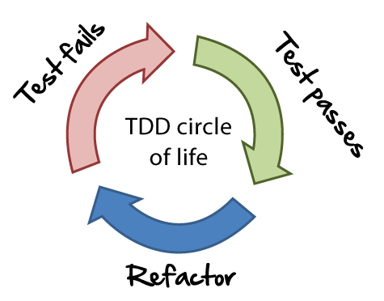

# Guia de testes iOS
-

## Objetivo
O objetivo deste documento é organizar uma séries de posts e um único local para tornar fácil o entendimento de testes.

## Pra que servem testes?

Por um longo período, eu programei sem escrever uma única linha de teste. Na verdade, eu pensava que escrever testes era uma perda de tempo até começar a trabalhar em uma empresa na qual eu deveria criar novos recursos para um aplicativo mal escrito. Toda vez que eu escrevia uma nova linha, eu revisava o app centenas de vezes apenas para ter certeza que tudo estava funcionando e mesmo assim ainda ficava com um pé atrás na hora de gerar uma nova release. Isso me fez perceber a importância dos testes, mas mesmo com isso em mente eu não dava o valor necessário.

## SWOT dos testes

Matriz SWOT (ou FOFA) é uma ferramenta muito usada em planejamento estratégico com o objetivo de fazer análise de cenários e verificar equilibrio entre fatores internos e externos. Pela sua simplicidade pode ser aplicada em quase tudo.

### Força e Oportunidades

Analisando de um contexto interno e externo ao projeto, quais as vantagens de se realizar testes? Podemos citar algumas como:

* Dar segurança ao desenvolvedor para mexer no código e ter certeza que não quebrou nada;
* Ao criar uma `suit` de testes dentro de um projeto o desenvolvedor testa casos de sucesso e erro, gerando certezas nos fluxos.
* Ter um projeto de fácil manutenção e diminuindo esse custo;
* Confiança ao gerar novas `releases`.


### Fraquezas e Ameaças

Apesar de suas vantagens, existem também desvantages ao se escrever testes em um projeto como:

* Testes impactam no tempo de build da CI/CD;
* Torna o processo de desenvolvimento mais lento e o processo de `releases` mais lentas devido ao tempo que deve ser dedicado para a escrita dos testes;

E outros.

Todos os pontos devem ser analisados e riscos devem ser minimizados, aceitados e contornados.

## O 5W2H dos testes

5W2H é uma ferramenta de gestão que significa: what (o que), why (por que), where (aonde), when (quando), who (quem), how (como) e how much (quanto custa). É usado como um checklist para tarefas a serem desenvolvidas mas são pergutas importantes que todo desenvolvedor deve saber responder quando se trata de testes.

### O que? (O que são testes?)

São trechos de código que visam testar métodos, funções, classes etc. Testar significa verificar o comportamento e assegurar que o mesmo está como o esperado. Por isso é importante testar casos de sucesso e casos de erro.

### Por que? (Porque devemos escrever testes?)

Testar deixa o código mais seguro para novas implementações. Durante o desenvolvimento de uma nova feature o desenvolvedor não irá precisar se preocupar se o novo código fez com que uma funcionalidade antiga deixasse de funcionar.

### Aonde? (Em que projetos devemos escrever testes?)

Devem ser feitos em todos os projetos, até nos que são feitos por um único desenvolvedor. Pois escrever testes ajuda a escrever um código mais limpo e desacoplado.

### Quando? (Qual momento devemos escrever testes?)

No momento do desenvolvimento daquela funcionalidade. Um teste não deve ser deixado como débito técnico para ser entregue no futuro ou em uma próxima sprint. Ele deve fazer parte do desenvolvimento daquela funcionalidade.

### Quem? (Quem é o responsável por escrever os testes?)

O teste deve ser escrito pelo mesmo profissional que está desenvolvendo a funcionalidade pois ninguém melhor do que ele sabe como feita a implementação.

### Como? (Como devemos escrever testes?)

Existem diversas maneiras de se escrever testes para iOS. Diversos frameworks que serão descritos abaixo mas o importante é que o COMO deve ser alinhado com o time para que um padrão seja mantido.

### Quanto custa? (Quanto custa escrever um testes?)

Escrever testes custa sim! O desenvolvedor irá parar por algumas horas para poder assegurar que seu código esteja com uma cobertura de testes aceitável mas ele não deve ser encarado como um custo que pode ser removido ou ignorado no projeto pois caso o projeto opte por não fazer testes o custo de manutenção do projeto irá aumentar.

## Os 3A's dos testes

Escrever um código de teste é diferente do que escrever um código para um aplicativo. Quando eu digo que é diferente não é em relação à sintaxe mas sim na lógica da escrita pois testes são escritos seguindo os 3A's que são: arrange, act, assert.

### Arrange

Neste momento você deve configura tudo que você precisa pro seu teste, instânciar objetos, mockar serviços, preparar respostas e etc.

### Act

No segundo momento você deve agir, ou seja, fazer aquela chamada que será testada ou passar parâmetros necessários para o objeto.

### Assert

E por último você deve verificar o resultado do teste. Checar se aquele boleano é `true` ou `false` se o nome da pessoa é `Rodrigo` e outras validações.

```swift
func test() {

	//Arrange
	let a = "a"
	let b = "b"
	let expectedResult = false
	let sut = MyObject()
	
	//Act
	result = sut.method(a, b)
	
	//Assert
	Assert.equal(expectedResult, result)
}
```

## O que aprendi com 1 mês de TDD.

Um dia meu colega de trabalho veio com uma ideia: “vamos começar este novo projeto com um novo processo, vamos usar TDD!”. Mas o que diabos é TDD? Pois bem, é um processo de software que incentiva programadores a escrever testes antes de escrever código.

> Test Driven Development (TDD) ou em português Desenvolvimento guiado por testes é uma técnica de desenvolvimento de software que se relaciona com o conceito de verificação e validação e se baseia em um ciclo curto de repetições: Primeiramente o desenvolvedor escreve um caso de teste automatizado que define uma melhoria desejada ou uma nova funcionalidade. Então, é produzido código que possa ser validado pelo teste para posteriormente o código ser refatorado para um código sob padrões aceitáveis. 

<p align="center">
	
</p>

Até aquele momento eu não havia escrito muitos códigos de teste e eu sabia que aquela decisão ia me fazer sofrer (em uma boa maneira). Iria aprender sobre testes, novas libs, e o mais importante: como escrever um bom código de teste.

Por duas semanas fizemos pair programming para que eu pudesse me acostumar com o TDD e seu ciclo de vida, que é: você escreve um código de teste, executa e ele provavelmente vai falhar. Na verdade, ele deve falhar e agora você pode escrever algum código, mas apenas o mínimo para fazer o seu teste passar. Execute o teste novamente, e ele deve passar. Então, você pode escrever mais testes ou refatorar seu código anterior sem adicionar novos recursos.

<p align="center">
	
</p>

### O que eu realmente aprendi com TDD?

Antes de tudo eu aprendi como escrever testes, de um parse de JSON até como testar uma UIView, e isso é maravilhoso porque não preciso mais testar meu app um bilhão de vezes em um simulador (ou device) antes de lançar uma feature nova. Os testes unitários fazem isso por você.

Segundo, eu me acostumei a escrever testes, e isso não é mais um monstro embaixo da cama. Na verdade, agora eu prefiro escrever testes antes do código e isso me fez escrever códigos melhores. Se você tem problemas em escrever testes provavelmente seu código está uma bagunça e você deveria refatorá-lo.

E por último, escrever testes fazem com que o código seja melhor escrito usando patterns e deixando as classes pouco acopladas melhorando a manutenibilidade do mesmo.

## Frameworks

### XCTest

O [XCTest] (https://developer.apple.com/documentation/xctest?changes=_8) é um framework criado pela Apple para escrita de testes unitários, de performance e UI.

> Use the XCTest framework to write unit tests for your Xcode projects that integrate seamlessly with Xcode's testing workflow.


### Quick

O [Quick] (https://github.com/Quick/Quick) é um framework, BDD (Behavior Driven Development) inspirado no `RSpec`, que estrutura e organiza os testes definindo contextos para diferentes tipos de testes, `beforeEach` e o teste por si só. É útil  para deixar seus testes mais legíveis.

> Quick is a behavior-driven development framework for Swift and Objective-C

### Nimble

[Nimble] (https://github.com/Quick/Nimble) é um framework de `matchers` ou seja
de asserções. Em vez de usar : `XCTAssertEqual(1+1,2,"expected one plus one equal two")` você escreve `expect(1+1) == 2`

> Use Nimble to express the expected outcomes of Swift or Objective-C expressions

### iOSSnapshotTestCase

Antigo FBSnapshotTestCase, o [iOSSnapshotTestCase] (https://github.com/uber/ios-snapshot-test-case/) tira fotos da tela do seu aplicativo e faz comparações  pixel a pixel com uma imagem de referência. Caso encontre alguma diferença o teste falha.

> A "snapshot test case" takes a configured UIView or CALayer and uses the renderInContext: method to get an image snapshot of its contents. It compares this snapshot to a "reference image" stored in your source code repository and fails the test if the two images don't match.

### KIF

[KIF] (https://github.com/kif-framework/KIF) é um framework para escrever testes de integração muito utilizado para testar eventos de UI como um `tap` em um botão, um `scroll` em uma UITableView ou até mesmo um fluxo inteiro de cadastro.

> KIF, which stands for Keep It Functional, is an iOS integration test framework. It allows for easy automation of iOS apps by leveraging the accessibility attributes that the OS makes available for those with visual disabilities.

### EarlGrey


[EarlGrey] (https://github.com/google/EarlGrey) é uma ferramenta de automação de testes de UI para iOS. Ela disponibiliza várias features dentre as quais podemos destacar: 

* Sincronização de UI, rede, threads entre outros
* Verificação de visibilidade do componente;
* Simula a interação real do usuário através das APIs de eventos de touchs no nível de aplicação;

> EarlGrey is a native iOS UI automation test framework that enables you to write clear, concise tests.


## Testes na prática

Os exemplos abaixo foram tirados de posts do medium e traduzidos. Alguns podem não executar por diversos mas o importante é entender a essencia do teste e o motivo.

* [Unit Testing — UIView with Nimble+Snapshot] (https://medium.com/cocoaacademymag/unit-testing-uiview-with-nimble-snapshot-651a7c5a5e93)
* [Unit Testing — Parsing a JSON response] (https://medium.com/cocoaacademymag/unit-testing-parsing-a-json-response-b694a1b669ff)
* [Unit Testing — Network request] (https://medium.com/cocoaacademymag/unit-testing-network-request-3a75061fcf4c)
* [Unit Testing — UITableView] (https://medium.com/cocoaacademymag/unit-testing-uitableview-2387f3a42b4f)
* [Unit Testing — KIF and FBSnapshot] (https://medium.com/cocoaacademymag/unit-testing-kif-and-fbsnapshot-67bd8e7397ac)